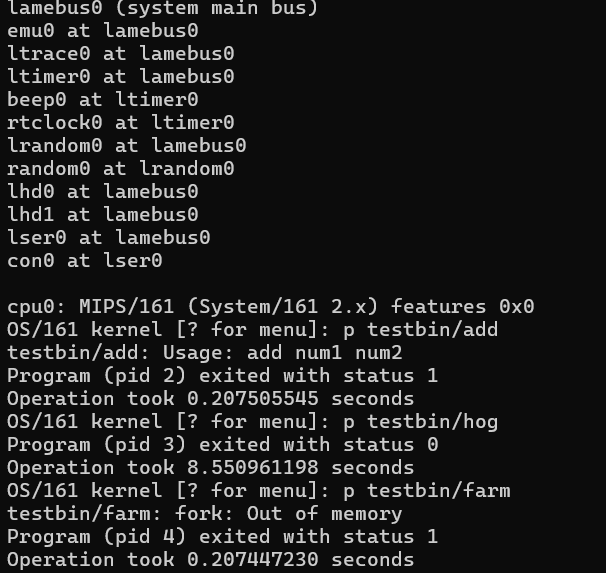
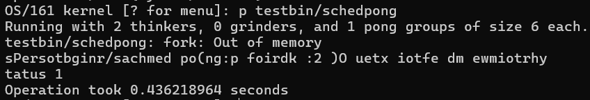
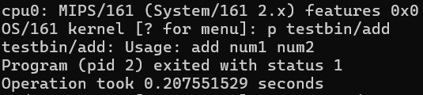
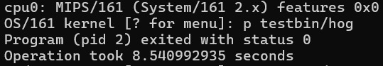
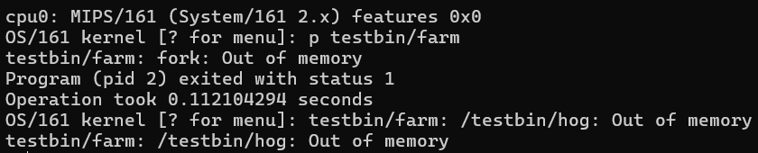
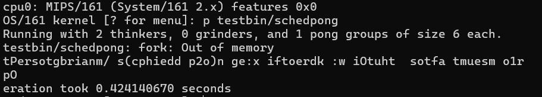
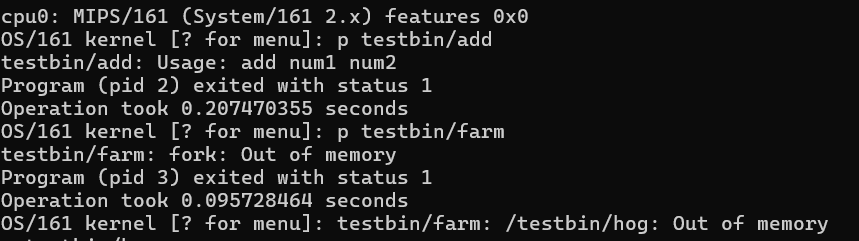
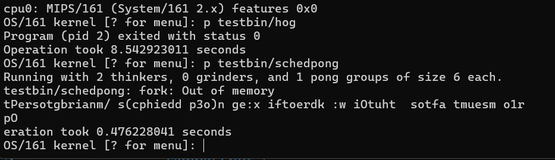

# OS/161 Scheduler MLFQ and FCFS Implementation

**Team Members:** Khurram Valiyev, Chase Monigle

## Design

### FCFS

The FCFS scheduler executes threads in the order they arrive, without preemption. Once a thread starts running, it holds the CPU until it terminates or blocks voluntarily. This reduces context switching and provides a simple, low-overhead scheduling policy.

While this leads to slightly better throughput on long-running jobs, it suffers in responsiveness—short threads may wait a long time behind long ones. FCFS performs best in workloads where threads have similar burst lengths or batch-style processing.

### MLFQ

The MLFQ scheduler dynamically prioritizes threads using three queues:
- Level 0 (High Priority) – 2 ticks
- Level 1 (Medium Priority) – 4 ticks
- Level 2 (Low Priority) – 8 ticks

Threads begin at the highest level. If a thread uses up its full quantum, it is demoted to a lower priority level. This favors interactive or I/O-bound threads that yield frequently.

To prevent starvation, an aging mechanism promotes all threads to the top level every 100 ticks.

**Benefits:**
- Better responsiveness for short jobs
- Balances fairness and throughput
- Starvation-free due to periodic aging

**Trade-offs:**
- More complex than FCFS
- More context switching than FCFS in certain workloads

---

## Implementation

### FCFS

FCFS was implemented by removing time-slice-based yielding from hardclock() in clock.c, the call to thread_yield() was disabled, allowing threads to run uninterrupted.

There was no need to change anything else as the code provided to us was already close to a FCFS approach

### MLFQ

The MLFQ scheduler we implemented uses three levels of priority queues to manage threads based on their CPU usage. Each thread begins in the highest priority queue (Level 0), with short time quanta to encourage responsiveness. If a thread uses up its entire quantum without yielding, it is demoted to a lower-priority queue. Lower queues are given longer time quanta, favoring throughput for CPU-bound tasks.

To prevent starvation, we implemented an aging mechanism that promotes all threads back to the top queue after a fixed number of clock ticks (100). This ensures that long-waiting threads eventually regain access to CPU time.

The implementation involved replacing the run queue with three separate queues (one per level), tracking how long each thread had been running, and adjusting its priority accordingly. The main logic was added to the clock interrupt handler (hardclock) to monitor thread tick usage and perform demotion or promotion when necessary. The scheduler was also modified to always pick threads from the highest non-empty queue.

Compared to FCFS and round-robin, MLFQ offers better responsiveness for interactive tasks and more fairness under diverse workloads. Its adaptability makes it well-suited for real-world systems where threads vary significantly in behavior.

### Benchmarks

## Default

## FCFS

## MLFQ

